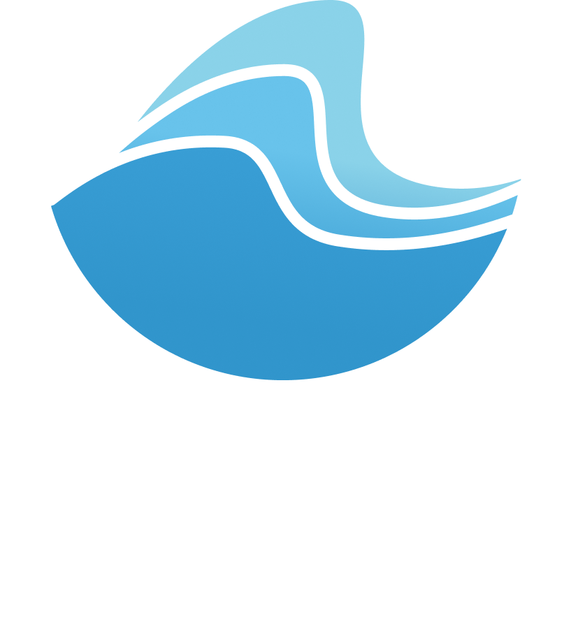
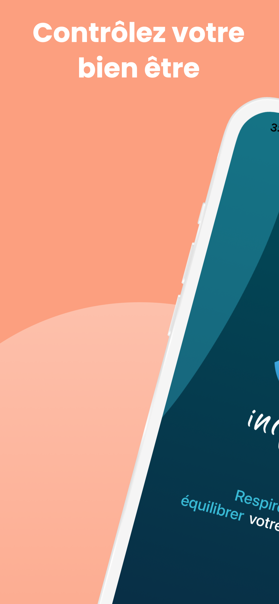
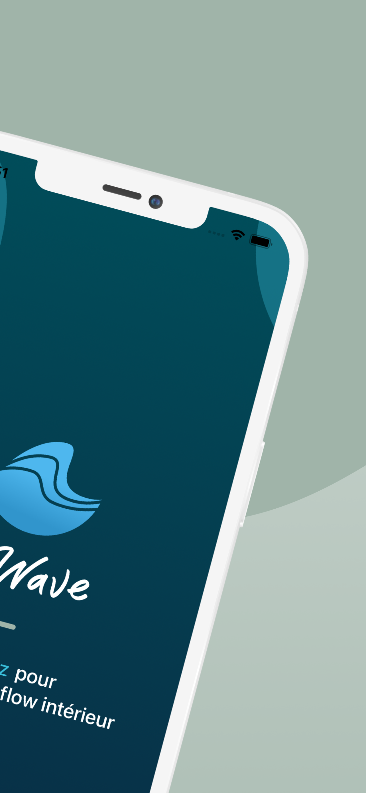
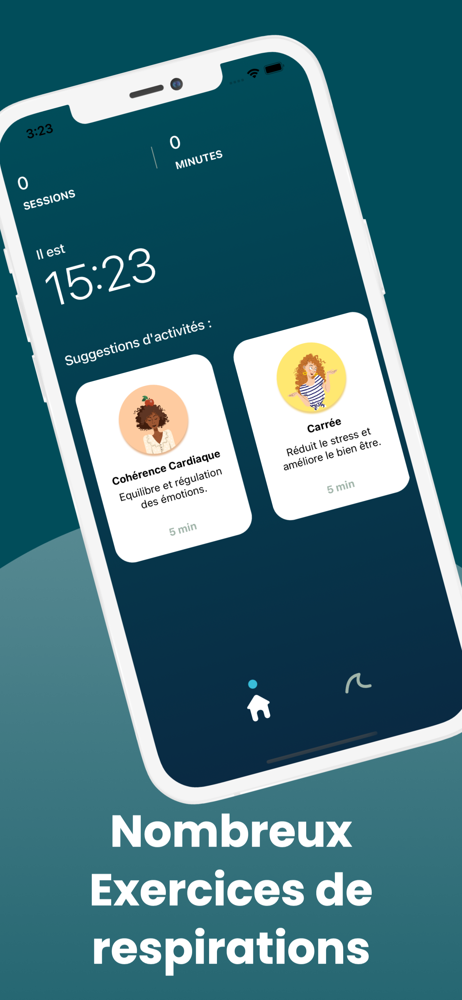

<br/>
<p align="center">

</p>   

<br/>

# 🌊 InWave 🌊


📱An **iOS app** dedicated to 💆‍♂️ **breath** and 💆‍♀️ **relaxing**. 

[AppStore link](https://apps.apple.com/fr/app/inwave/id1561009206)

# 👩🏽‍🎨 👨🏽‍🎨 🥷 👨‍💻 People involved

- **Melissa Glissant** for the [illustrations](https://dencreetdesel.fr/portfolio/)
- **Eric Pause** for the [UI/UX](https://fr.linkedin.com/in/ericpause)
- **Pierre Navarron** for the [sound design](https://fr.linkedin.com/in/pierre-navarron)
- **Laurent Droguet** for the [development](https://fr.linkedin.com/in/laurent-droguet-engineer-rd)

# Appearance

<p float="left">
  
   
  
</p>

# How to run ?
```
git clone git@github.com:hyazel/InWave.git

```

# Dependencies


- Using Swift package manager (SPM) :

[Lottie](https://github.com/airbnb/lottie-ios)  


# Architecture

Minimum version recquired : **iOS14**

**MVVM** + **SwiftUI**

Several **modules** :

- **Design system** : UI, colors, ...
- **Core** : breath engine, storage, ...
- **Common** : Dependencies container, extensions, ...


